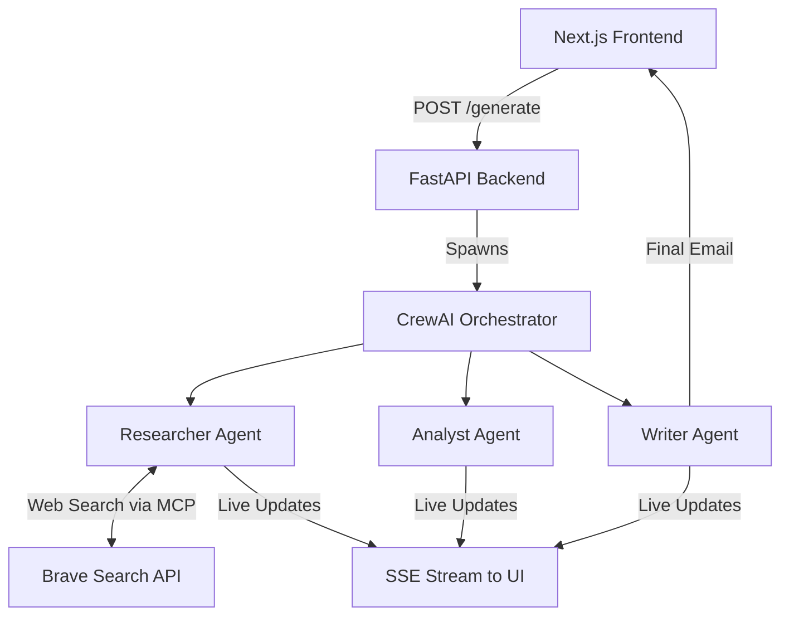

# B2B Outreach Engine 🚀

An AI-powered B2B cold email generator that actually does its homework.

Instead of relying on generic ChatGPT prompts, this engine deploys a **team of autonomous AI agents** (powered by CrewAI and Groq) to scour the live internet, research your target company, analyze their specific pain points, and write a highly personalized, hyper-targeted cold email pitching your offering.

---

## 🌟 How it Works

The engine uses a 3-Agent architecture to guarantee high-quality results:

1. 🕵️‍♂️ **The Researcher:** Uses live web-search tools (via an MCP Server) to find the latest news, blog posts, and technical constraints of your target company.
2. 🧠 **The Analyst:** Takes the raw research and identifies the specific *pain points* and *strategic goals* of the person you are trying to email.
3. ✍️ **The Writer:** Uses the Analyst's insights to draft a concise, non-salesy, highly personalized email that positions your offering as the exact solution they need.

## 🛠️ Tech Stack

This project is built with a decoupled architecture, separating the heavy AI processing from the user interface.

**Frontend (The UI):**
* **Framework:** Next.js (React) & TypeScript
* **Styling:** Tailwind CSS & Glassmorphism UI
* **Real-time UX:** Server-Sent Events (SSE) to stream live agent thoughts to the screen.

**Backend (The AI Brain):**
* **Framework:** FastAPI (Python)
* **Agent Orchestration:** CrewAI
* **LLM Provider:** Groq (Llama-3.3-70b-versatile) for lightning-fast, ultra-cheap inference.
* **Tooling:** Model Context Protocol (MCP) server running a Brave Search integration.
* **Observability:** LangSmith integration for tracing AI agent execution.

## ⚙️ Architecture



## 🚀 Running Locally

### 1. Backend Setup
```bash
cd backend
python -m venv .venv
source .venv/bin/activate  # (or .\.venv\Scripts\activate on Windows)
pip install -r requirements.txt
```
Create a `.env` file in the `backend/` folder:
```env
GROQ_API_KEY=your_groq_key
BRAVE_API_KEY=your_brave_key
LANGSMITH_API_KEY=your_langsmith_key
LANGCHAIN_TRACING_V2=true
LANGCHAIN_PROJECT=b2b-outreach-engine
```
Run the backend:
```bash
uvicorn main:app --port 8000
```

### 2. Frontend Setup
```bash
cd frontend
npm install
```
Create a `.env.local` file in the `frontend/` folder:
```env
NEXT_PUBLIC_API_URL=http://localhost:8000
```
Run the frontend:
```bash
npm run dev
```

## ☁️ Deployment

* **Backend:** Easily deployable to **Render** as a Web Service (Python 3.12+ required).
* **Frontend:** Easily deployable to **Vercel** (ensure Root Directory is set to `frontend`).
